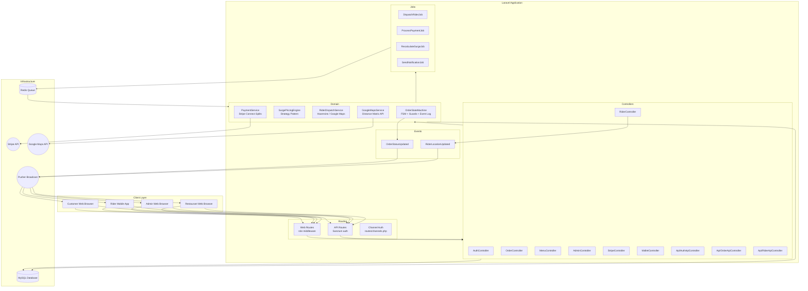
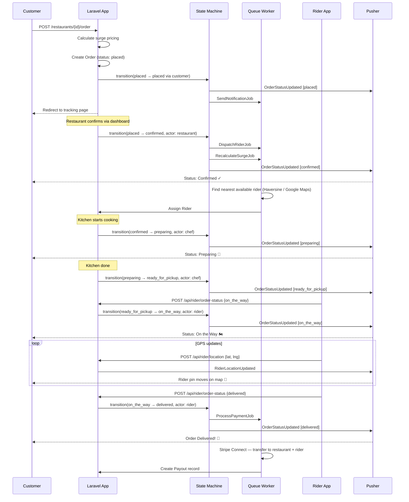
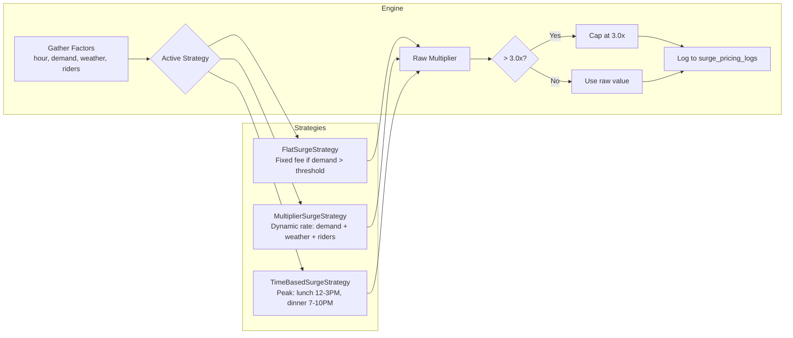
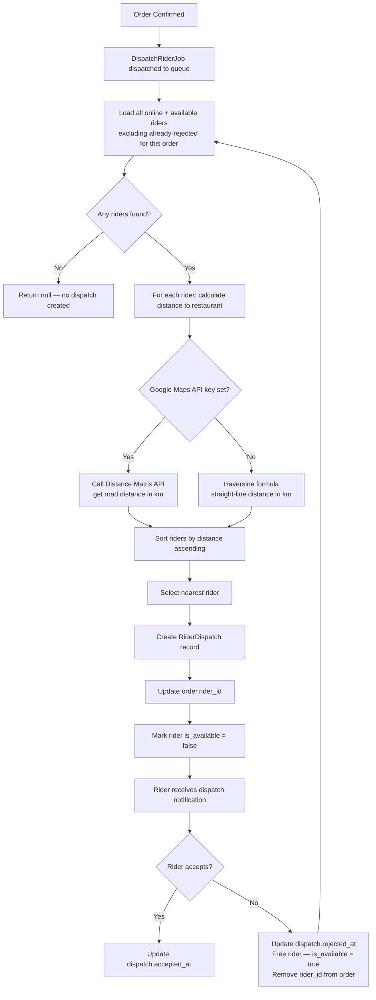
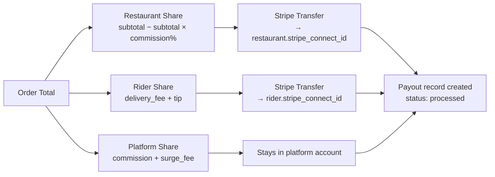

# DeliverEats — System Architecture

## Overview

DeliverEats is a multi-restaurant food delivery platform built on **Laravel 12**, following clean architecture principles with domain services, a finite state machine, strategy pattern pricing, and an event-driven real-time layer.

---

## System Component Diagram



---

## Order Flow — End to End



---

## Database Schema

### Core Tables (21 total)

```
users                       id, name, email, password, role, phone, wallet_balance, restaurant_id
restaurants                 id, owner_id, name, address, lat, lng, cuisine_type, is_open, is_active, commission_rate, stripe_connect_id
categories                  id, restaurant_id, name, display_order, is_active
menu_items                  id, category_id, name, description, price, prep_time, is_available
item_variants               id, menu_item_id, name, price_modifier
orders                      id, customer_id, restaurant_id, rider_id, status, subtotal, delivery_fee, surge_fee, tip, total, delivery_address, payment_method, payment_status, delivered_at
order_items                 id, order_id, menu_item_id, variant_id, quantity, unit_price, subtotal
order_state_logs            id, order_id, from_state, to_state, actor_type, actor_id, metadata, transitioned_at
riders                      id, user_id, current_lat, current_lng, is_online, is_available, total_deliveries, total_earnings, stripe_connect_id
rider_dispatches            id, order_id, rider_id, distance_km, dispatched_at, accepted_at, rejected_at, rejection_reason
ratings                     id, rateable_type, rateable_id, user_id, score, created_at
reviews                     id, restaurant_id, user_id, order_id, content, response, created_at
surge_pricing_logs          id, restaurant_id, multiplier, strategy, reason, factors, triggered_at, expired_at, is_active
payouts                     id, order_id, order_total, restaurant_amount, rider_amount, platform_amount, platform_commission_pct, status, processed_at
notifications               id, user_id, title, body, type, data, read_at, created_at
transactions                id, user_id, type, amount, reference, description, created_at
feedback                    id, name, email, subject, message, status, created_at
personal_access_tokens      (Sanctum standard)
cache / jobs / sessions     (Laravel standard)
```

---

## Surge Pricing Engine



**Factors evaluated:**
- `demand` — active orders placed in the last 60 minutes
- `available_riders` — riders currently online and not busy
- `weather` — `clear | rain | storm | snow | extreme`
- `hour` — current hour (0–23), day of week

**Strategy selection** is done at runtime via `SurgePricingEngine::setStrategy()` or `getStrategyByName()`.

---

## Rider Dispatch Algorithm



---

## Payment Split Architecture



**Example split at 15% commission:**

| Amount | Formula | Result |
|---|---|---|
| Subtotal | (food items) | 80.00 |
| Commission (15%) | 80 × 0.15 | 12.00 |
| Delivery fee | fixed | 10.00 |
| Surge fee | dynamic | 5.00 |
| Tip | customer set | 5.00 |
| **Order total** | | **112.00** |
| → Restaurant | 80 − 12 | **68.00** |
| → Rider | 10 + 5 | **15.00** |
| → Platform | 12 + 5 | **17.00** |
| **Total allocated** | | **100.00** ✓ |

---

## Role & Middleware System

| Role | Access |
|---|---|
| `customer` | Browse, order, track, rate, wallet |
| `restaurant_owner` | Dashboard, menu, orders, revenue, staff |
| `chef` | Chef dashboard, order preparation status |
| `rider` | Rider panel, dispatch accept/reject, GPS, earnings |
| `admin` | All of the above + simulations, live map, platform revenue |

Route protection is handled by `RoleMiddleware` — e.g. `middleware('role:restaurant_owner,admin')`.

---

## Technology Stack

| Component | Technology | Version |
|---|---|---|
| Backend framework | Laravel | 12.x |
| PHP | PHP | 8.2+ |
| Authentication (web) | Laravel session | — |
| Authentication (API) | Laravel Sanctum | 4.x |
| Real-time broadcasting | Pusher + Laravel Echo | 7.x |
| Queue processing | Redis / Database | — |
| Payments | Stripe Connect | 20.x SDK |
| Distance calculation | Google Maps Distance Matrix / Haversine | — |
| Maps (frontend) | Leaflet.js + OpenStreetMap | — |
| Frontend components | Blade + Bootstrap 5 + Alpine.js | — |
| Charts | Chart.js | CDN |
| Icons | Font Awesome 6 | CDN |
| Testing | PHPUnit | 11.x |
| Package management | Composer + npm | — |
