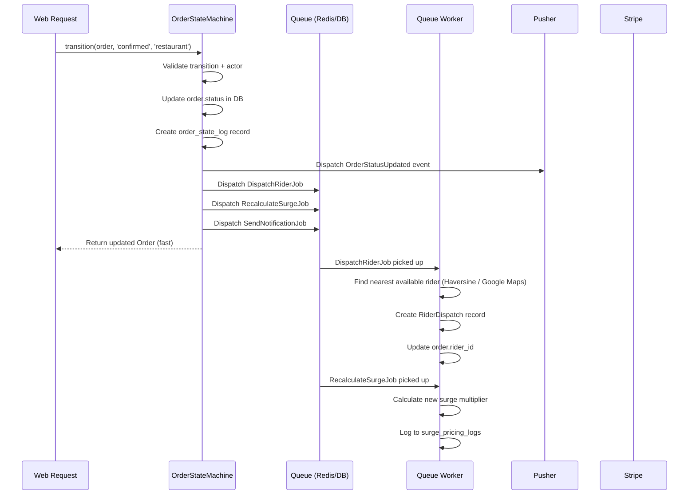
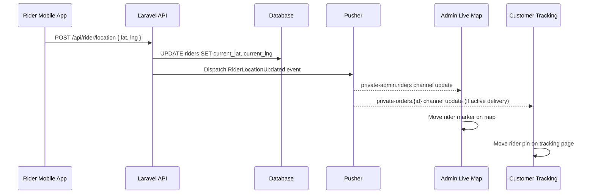
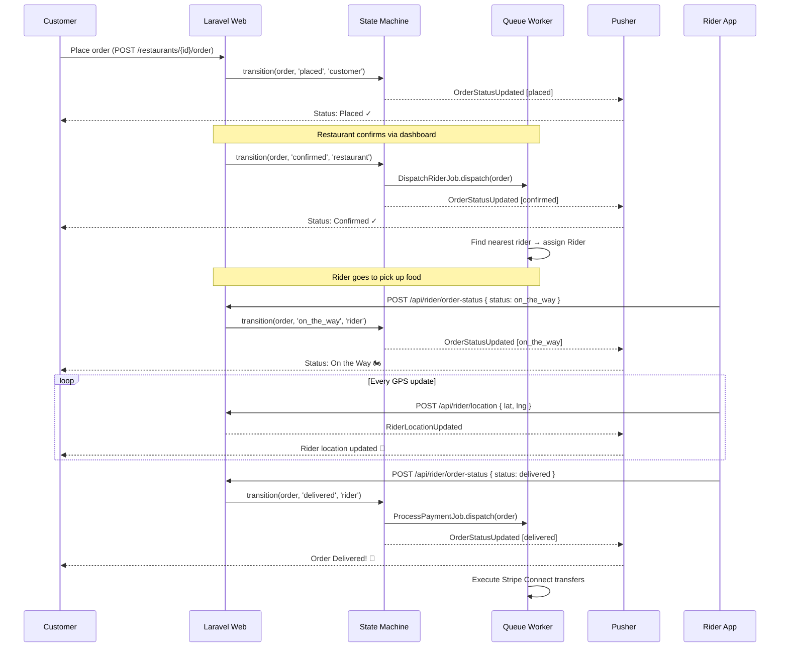
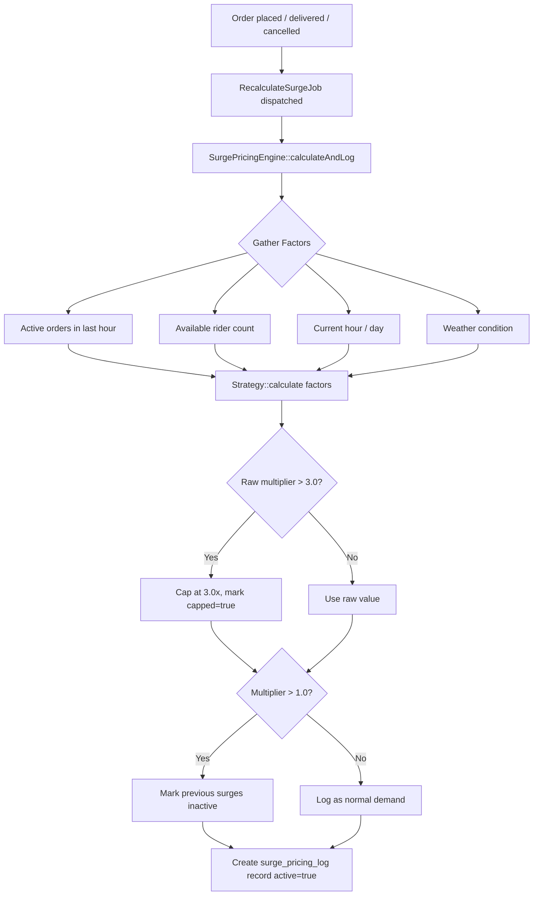

# DeliverEats — Real-Time Architecture

## Overview

DeliverEats uses a **hybrid real-time approach** combining **Pusher broadcasting** (for instant push to clients) and **Redis/Database queues** (for background job processing). Together they enable live order tracking, rider GPS updates, and asynchronous surge recalculation — all without blocking web requests.

---

## 1. Broadcasting (Pusher / Laravel Echo)

### How It Works

1. An event occurs in the application (order status changes, rider moves)
2. Laravel dispatches a broadcast event that implements `ShouldBroadcast`
3. The event is sent to Pusher via the configured broadcast driver
4. Frontend clients subscribed via **Laravel Echo** receive the update instantly
5. The UI updates without any page refresh

### Broadcast Events

#### `OrderStatusUpdated`
Fired every time `OrderStateMachine::transition()` is called.

```
Channels:
  private-orders.{order_id}           → customer + rider + restaurant
  private-restaurant.{restaurant_id}  → restaurant owner dashboard
  private-admin.orders                → admin control tower

Payload:
{
  "order_id": 42,
  "status": "on_the_way",
  "updated_at": "2024-05-05 14:32:10"
}
```

#### `RiderLocationUpdated`
Fired every time a rider calls `POST /api/rider/location`.

```
Channels:
  private-admin.riders                → admin live map
  private-orders.{order_id}           → customer tracking page (if rider has active order)

Payload:
{
  "rider_id": 3,
  "lat": 30.0520,
  "lng": 31.2400,
  "updated_at": "2024-05-05 14:32:15"
}
```

### Channel Authorization (`routes/channels.php`)

| Channel | Authorization Rule |
|---|---|
| `orders.{orderId}` | Customer who placed it, assigned rider, restaurant owner, or admin |
| `admin.orders` | Admin role only |
| `admin.riders` | Admin role only |
| `App.Models.User.{id}` | User's own private notification channel |

### Frontend Subscription Example (Laravel Echo)

```javascript
// Customer tracking page — listens for order status and rider location
Echo.private(`orders.${orderId}`)
    .listen('OrderStatusUpdated', (event) => {
        updateStatusBadge(event.status);
    })
    .listen('RiderLocationUpdated', (event) => {
        riderMarker.setLatLng([event.lat, event.lng]);
    });

// Admin — listens to all riders
Echo.private('admin.riders')
    .listen('RiderLocationUpdated', (event) => {
        updateRiderMarker(event.rider_id, event.lat, event.lng);
    });
```

---

## 2. Queue Architecture (Redis / Database)

Background jobs are used for all operations that are too slow or too unreliable to run synchronously in a web request.

### Queue Jobs

| Job | Trigger | What It Does |
|---|---|---|
| `DispatchRiderJob` | Order confirmed | Calls `RiderDispatchService::dispatchRider()` to find and assign nearest rider |
| `ProcessPaymentJob` | Order delivered | Calls `PaymentService::processPayment()` to execute Stripe Connect transfers |
| `RecalculateSurgeJob` | Order placed / delivered / cancelled | Calls `SurgePricingEngine::calculateAndLog()` to update area surge multiplier |
| `SendNotificationJob` | Every FSM transition | Inserts notification record + can send push/email |

### Queue Flow Diagram



### Queue Configuration

```env
# Local development (no Redis needed)
QUEUE_CONNECTION=database

# Production (faster, more reliable)
QUEUE_CONNECTION=redis
REDIS_HOST=127.0.0.1
REDIS_PORT=6379
```

Start the queue worker:
```bash
# Development
php artisan queue:work

# Production (with retry and timeout)
php artisan queue:work --tries=3 --timeout=60

# Using Laravel Horizon (Redis only)
php artisan horizon
```

---

## 3. GPS Tracking Flow

Riders update their location via the mobile API. Each update triggers both a database write and a real-time broadcast.



---

## 4. Real-Time Order Tracking Flow (Full Sequence)



---

## 5. Surge Pricing Recalculation Flow



---

## 6. Admin Live Map (Polling Fallback)

When Pusher is not configured, the Admin Live Map falls back to **JavaScript polling**:

```javascript
// Refreshes every 5 seconds
setInterval(refreshMap, 5000);

function refreshMap() {
    fetch('/admin/live-data')          // GET /admin/live-data
        .then(r => r.json())
        .then(data => {
            data.riders.forEach(rider => {
                if (markers.riders[rider.id]) {
                    markers.riders[rider.id].setLatLng([rider.lat, rider.lng]);
                }
            });
        });
}
```

The `/admin/live-data` endpoint returns current rider positions and restaurant statuses. This provides a working live map even without Pusher credentials configured.
