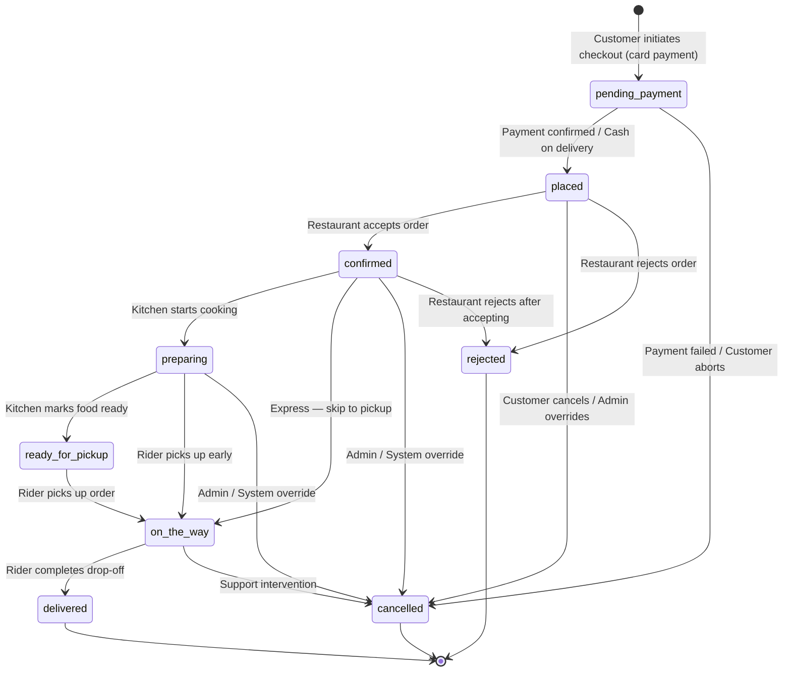

# DeliverEats — Order State Machine

## Overview

The order lifecycle in DeliverEats is managed by a **Finite State Machine (FSM)** implemented in `app/StateMachine/OrderStateMachine.php`. The FSM enforces strict business rules through transition guards, actor permission checks, and a full event-sourcing audit trail.

---

## State Diagram



---

## States Reference

| State | Description | Terminal? |
|---|---|---|
| `pending_payment` | Order created, awaiting Stripe payment confirmation | No |
| `placed` | Order confirmed/paid, awaiting restaurant acceptance | No |
| `confirmed` | Restaurant accepted, rider dispatch triggered | No |
| `preparing` | Kitchen is actively cooking | No |
| `ready_for_pickup` | Food packaged, waiting for rider at restaurant | No |
| `on_the_way` | Rider picked up order, en route to customer | No |
| `delivered` | Order successfully delivered | **Yes** |
| `cancelled` | Order cancelled by any authorized actor | **Yes** |
| `rejected` | Order rejected by restaurant | **Yes** |

---

## Transition Map

```
pending_payment  ──► placed, cancelled
placed           ──► confirmed, cancelled, rejected
confirmed        ──► preparing, cancelled, rejected, on_the_way
preparing        ──► ready_for_pickup, cancelled, on_the_way
ready_for_pickup ──► on_the_way
on_the_way       ──► delivered, cancelled
delivered        ──► (none — terminal)
cancelled        ──► (none — terminal)
rejected         ──► (none — terminal)
```

---

## Actor Permissions

Each transition can only be triggered by authorized actor types:

| Transition (to state) | Authorized Actors |
|---|---|
| `pending_payment` | `customer`, `system` |
| `placed` | `customer`, `system`, `admin` |
| `confirmed` | `restaurant`, `chef`, `system`, `admin` |
| `preparing` | `restaurant`, `chef`, `admin` |
| `ready_for_pickup` | `restaurant`, `chef`, `admin` |
| `on_the_way` | `rider`, `restaurant`, `system`, `admin` |
| `delivered` | `rider`, `restaurant`, `system`, `admin` |
| `cancelled` | `customer`, `restaurant`, `chef`, `rider`, `system`, `admin` |
| `rejected` | `restaurant`, `admin` |

---

## Guard Rules

The FSM enforces two types of guards on every `transition()` call:

### 1. Transition Guard
Checks whether the `from → to` transition is in the allowed map. If not, throws:
```
InvalidArgumentException: Invalid order state transition: {from} → {to}.
Allowed transitions from '{from}': {list}
```

### 2. Actor Guard
Checks whether the calling actor type is authorized for the target state. If not, throws:
```
InvalidArgumentException: Actor type '{actor}' is not allowed to transition order to '{state}'.
```

---

## Event Sourcing

Every state transition is logged to the `order_state_logs` table with:

| Column | Type | Description |
|---|---|---|
| `order_id` | integer | Foreign key to `orders` |
| `from_state` | string | Previous state |
| `to_state` | string | New state |
| `actor_type` | string | Who triggered it (`customer`, `restaurant`, `rider`, `admin`, `system`) |
| `actor_id` | integer\|null | ID of the actor (null for system) |
| `metadata` | json | Optional context (e.g. rejection reason, payment ID) |
| `transitioned_at` | timestamp | Exact time of transition |

This creates a **complete, immutable audit trail** for every order — useful for dispute resolution, analytics, and debugging.

---

## Side Effects on Transition

The FSM automatically triggers side effects on certain transitions:

| Transition | Side Effect |
|---|---|
| Any transition | `OrderStatusUpdated` event broadcast to Pusher |
| Any transition | `SendNotificationJob` dispatched to notify customer |
| `placed` | `RecalculateSurgeJob` dispatched |
| `confirmed` | `DispatchRiderJob` dispatched (find nearest rider) |
| `delivered` | `ProcessPaymentJob` dispatched (Stripe Connect splits) |
| `delivered` | `RecalculateSurgeJob` dispatched |
| `cancelled` / `rejected` | `RecalculateSurgeJob` dispatched |

---

## Code Example

```php
use App\StateMachine\OrderStateMachine;

// Transition to confirmed (by restaurant)
OrderStateMachine::transition($order, 'confirmed', 'restaurant', $restaurantOwnerId);

// Transition to delivered (by rider)
OrderStateMachine::transition($order, 'delivered', 'rider', $riderId, [
    'delivery_photo' => 'uploaded_123.jpg'
]);

// Check if a transition is valid without executing it
$canTransition = OrderStateMachine::canTransition('preparing', 'delivered'); // false

// Get allowed next states
$next = OrderStateMachine::getAllowedTransitions('confirmed');
// ['preparing', 'cancelled', 'rejected', 'on_the_way']

// Check if a state is terminal
$isTerminal = OrderStateMachine::isTerminal('delivered'); // true
```

---

## Test Coverage

| Test | Expected Behavior |
|---|---|
| `valid_transition_placed_to_confirmed` | Status updates to `confirmed` |
| `valid_transition_confirmed_to_preparing` | Status updates to `preparing` |
| `valid_full_lifecycle` | Full chain completes, `delivered_at` set |
| `invalid_transition_delivered_to_preparing_throws` | `InvalidArgumentException` thrown |
| `invalid_transition_cancelled_to_confirmed_throws` | `InvalidArgumentException` thrown |
| `invalid_backward_transition_throws` | `InvalidArgumentException` thrown |
| `state_transition_creates_log_entry` | Row inserted in `order_state_logs` |
| `cancellation_from_placed_is_allowed` | Status updates to `cancelled` |
| `terminal_states_have_no_transitions` | `getAllowedTransitions()` returns `[]` for all terminal states |
